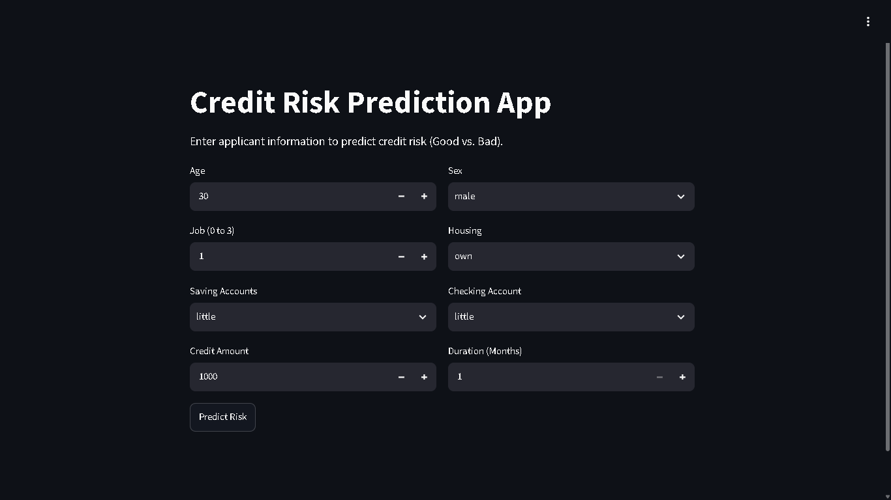
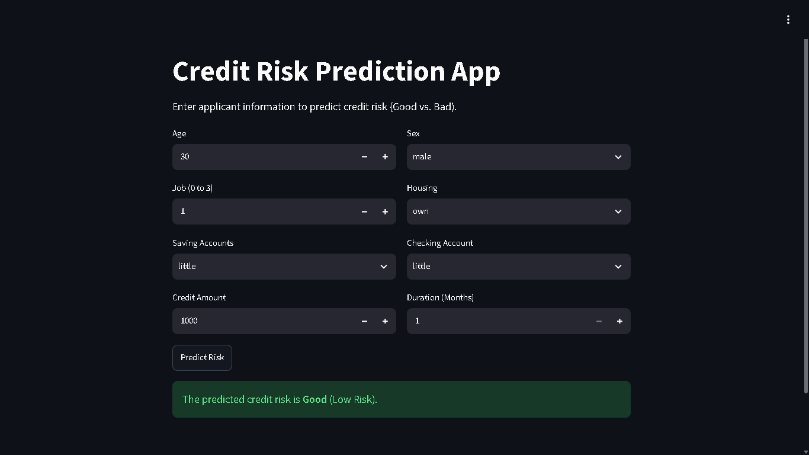

# Credit Risk Classification System
**Predicting Applicant Credit Risk (Good vs. Bad)**

## 📌 Table of Contents
- <a href="#project-overview">Project Overview</a>
- <a href="#business-objectives">Business Objectives</a>
- <a href="#data-sources">Data Sources</a>
- <a href="#eda">Exploratory Data Analysis</a>
- <a href="#models-used">Models Used</a>
- <a href="#metrics">Evaluation Metrics</a>
- <a href="#application">Application</a>
- <a href="#project-structure">Project Structure</a>
- <a href="#how-to-run-this-project">How to Run This Project</a>
- <a href="#author--contact">Author & Contact</a>
---

<h2><a class="anchor" id="project-overview"></a>📌 Project Overview</h2>

This project implements an **end-to-end machine learning system** designed to support financial institutions by:

1. **Predicting the credit risk** of an applicant (Good/Low Risk vs. Bad/High Risk) based on personal and financial factors.
2. **Identifying key factors** that contribute to credit default (like checking account status, credit amount, and duration).

---
<h2><a class="anchor" id="business-objectives"></a>🎯 Business Objectives</h2>

### Credit Risk Classification (Classification)
**Objective:**
Predict whether a credit applicant is a Good or Bad risk using features like age, sex, job, housing, saving accounts, checking account, credit amount, and loan duration.

**Why it matters:**
* Helps financial institutions mitigate potential financial losses from defaults.
* Assists in automated decision-making for loan approvals.
* Provides insights into how financial history (like saving and checking accounts) impacts creditworthiness.

---



---



## <a class="anchor" id="data-sources"></a>📁 Data Sources

Data is stored in the `datasets/` directory and contains records of credit applicants with the following key attributes:

* `age`, `credit_amount`, `duration`, `job` – Numerical/Ordinal features describing the applicant.
* `sex`, `housing`, `saving_accounts`, `checking_account` – Categorical features affecting financial risks.
* `risk` – The target variable representing the credit risk (Good vs. Bad).

---

## <a class="anchor" id="eda"></a>📊 Exploratory Data Analysis (EDA)

EDA, performed in the provided Jupyter Notebook (`notebooks/credit_risk_classification.ipynb`), focuses on **financial-driven questions**, such as:

* Do applicants with little saving accounts have higher default rates?
* How does credit amount correlate with risk?
* What is the impact of loan duration on the expected default risk?

Visualizations and statistical summaries are used to confirm the relationships between these features and the target variable.

## <a class="anchor" id="models-used"></a>🤖 Models Used

### Classification (Risk Prediction)
The project evaluates various classification algorithms to predict categorical credit risk. The best-performing model is saved as `best_model.pickle`.

Models evaluated:
* **Decision Tree Classifier**
* **Random Forest Classifier**
* **Extra Trees Classifier**

Data preprocessing includes:
* **LabelEncoder** for categorical variables (`sex_encoder.pickle`, `housing_encoder.pickle`, `saving_accounts_encoder.pickle`, `checking_account_encoder.pickle`, `target_encoder.pickle`).

## <a class="anchor" id="metrics"></a>📈 Evaluation Metrics

### Risk Classification
* Accuracy Score

## <a class="anchor" id="application"></a>🖥️ End-to-End Application

A **Streamlit application** demonstrates the complete pipeline:

* Input personal and financial details
* Predict expected credit risk in real time
* Provide an intuitive and interactive user interface

---

## <a class="anchor" id="project-structure"></a>📁 Project Structure

```text
credit-risk-classification/
├── datasets/
│   └── german_credit_data.csv
├── credit_risk_classification/
│   ├── data_preprocessing.py
│   ├── model_evaluation.py
│   └── train.py
├── images/
│   ├── image_1.png
│   └── image_2.png
├── models/
│   ├── best_model.pickle
│   ├── checking_account_encoder.pickle
│   ├── housing_encoder.pickle
│   ├── saving_accounts_encoder.pickle
│   ├── sex_encoder.pickle
│   └── target_encoder.pickle
├── notebooks/
│   └── credit_risk_classification.ipynb
├── app.py
├── requirements.txt
├── README.md
└── .gitignore
```
## <a class="anchor" id="how-to-run-this-project"></a>🚀 How to Run This Project

### 1. Clone the repository:
```bash
git clone https://github.com/Manoj-Bharathi-S/credit-risk-classification.git
cd credit-risk-classification
```

### 2. Create a virtual environment (recommended):
```bash
python -m venv .venv
source .venv/bin/activate  # On Windows use: .venv\Scripts\activate
```

### 3. Install the dependencies:
```bash
pip install -r requirements.txt
```

### 4. Open Application:
```bash
streamlit run app.py
```
---
## <a class="anchor" id="author--contact"></a>👥 Author & Contact

**Manoj Bharathi S**

* ✉️ Email: [manojbharathiwork@gmail.com](mailto:manojbharathiwork@gmail.com)
* 🔗 [LinkedIn](https://www.linkedin.com/in/manoj-bharathi)
